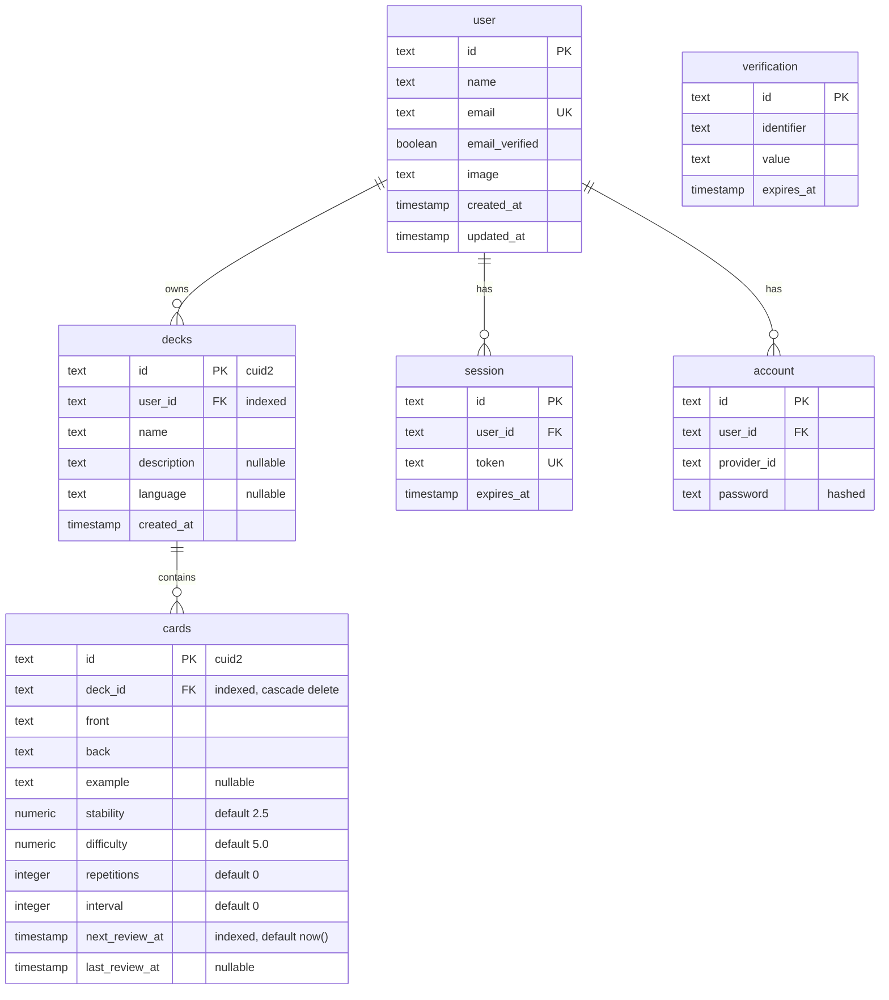

# Database

PostgreSQL (Neon) via Drizzle ORM. Schema lives in [`src/server/db/schema.ts`](../src/server/db/schema.ts); migrations are generated by `drizzle-kit` into [`drizzle/`](../drizzle).

## ERD

`decks` and `cards` are the application tables. `user`, `session`, `account`, and `verification` are generated by Better Auth — the app never writes to them directly.



## Ownership model

There is no `user_id` on `cards`. A card belongs to a user **through its deck**, and every card read or write joins `cards → decks` and filters on `decks.user_id`:

```sql
select cards.* from cards
  join decks on cards.deck_id = decks.id
 where cards.id = $1 and decks.user_id = $2
```

That single join is the authorization boundary for cards. `getUserCard()` in [`queries.ts`](../src/server/db/queries.ts) is the only way handlers load a card.

Deleting a deck cascades to its cards via the `deck_id` foreign key — the application issues one `delete` and Postgres removes the rest.

## FSRS columns

`stability`, `difficulty`, `repetitions`, `interval`, `next_review_at`, and `last_review_at` are written **only** by the review endpoint, from values computed server-side by [`fsrs.ts`](../src/server/lib/fsrs.ts). Clients submit a rating (1–4) and never a schedule.

`stability` and `difficulty` are `numeric(8,4)`, so Drizzle returns them as strings — they are cast with `Number()` before entering the scheduler and back to strings on write.

## Indexes

| Index             | Table   | Column           | Serves                                 |
| ----------------- | ------- | ---------------- | -------------------------------------- |
| `idx_deck_user`   | `decks` | `user_id`        | Deck list scoped to the signed-in user |
| `idx_card_deck`   | `cards` | `deck_id`        | Card list on the deck detail page      |
| `idx_card_review` | `cards` | `next_review_at` | The daily due queue                    |

## Migrations

```bash
pnpm db:generate   # generate SQL from schema.ts
pnpm db:migrate    # apply to DATABASE_URL
pnpm db:studio     # browse data
```
