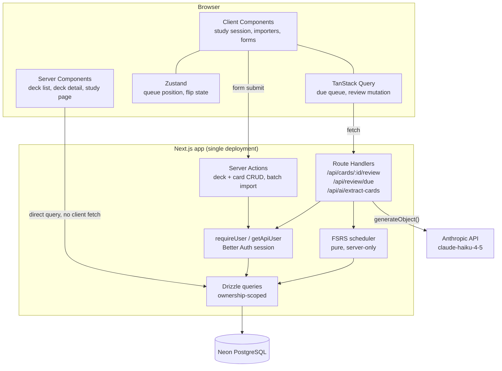

# Architecture

One Next.js application. No separate backend, no persistent server process, nothing to deploy independently.

## Why a single Next.js app

Single-user CRUD, some scheduling arithmetic, and one structured AI call. There is no persistent server, no real-time sync, and no second consumer that would justify a standalone API. Route Handlers and Server Actions cover the whole surface.

## Server Actions vs Route Handlers

The split is about **who initiates the call**, not about which is newer:

- **Server Actions** — deck and card CRUD. These are form-driven, so they get progressive enhancement and revalidate on submit.
- **Route Handlers** — the review submission, the due queue, and AI extraction. These are called imperatively from client code (the study session, TanStack Query mutations), which needs a status code to branch on.

## Boundaries that matter

**The scheduler never reaches the client.** `fsrs.ts` is a pure function with no imports, called only from the review handler. The client submits a rating; the server computes and persists the schedule. The rating buttons still preview intervals because the server computes all four candidates and sends them as data.

**Card ownership runs through the deck.** Cards carry no `user_id`. Every card read and write joins `cards → decks` and filters on `decks.user_id`, so an unowned card id is indistinguishable from a missing one.

**Client-side validation is convenience only.** The CSV importer flags bad rows in the preview and the AI extractor caps output, but `importCards` re-validates every row server-side against the same Zod schemas used for manual entry.

## State

| Kind                             | Where it lives                                                      |
| -------------------------------- | ------------------------------------------------------------------- |
| Server data on first paint       | Server Components querying Drizzle directly                         |
| Server data fetched imperatively | TanStack Query (due queue, review mutation with optimistic advance) |
| Local study-session UI           | Zustand (queue position, flip state)                                |
| Form state                       | `useActionState` on the Server Action                               |
